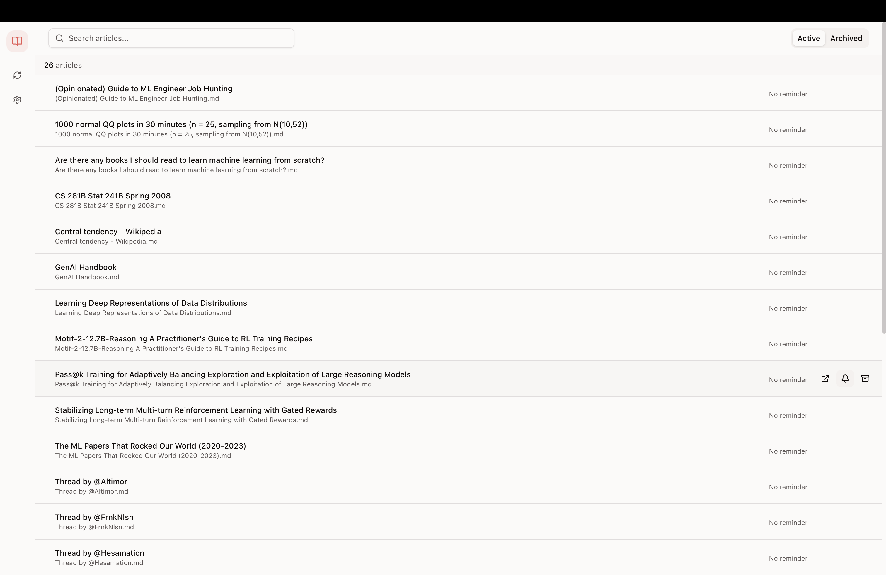
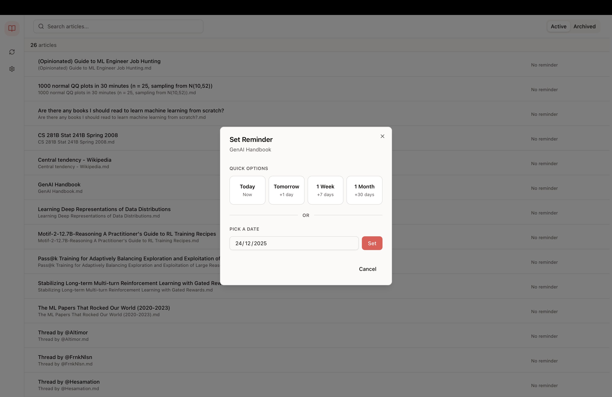

# Remember

Remember is a small Tauri desktop app that helps you keep a lightweight "reading inbox" for your Obsidian vault: it scans a folder of Markdown files, lists them as articles, and lets you set simple revisit reminders.

## Screenshots

| Main View | Set Reminder |
|-----------|--------------|
|  |  |

## What it does

- **Sync from an Obsidian vault folder**: recursively finds `*.md` files (skips hidden dirs like `.obsidian`, `.git`).
- **Local library**: stores article metadata (path, title, relative path) in a local SQLite DB.
- **Reminders**: set a reminder date per article; shows “due” items and a due-count indicator.
- **Snooze / Done flows**:
  - **Snooze** moves the reminder date forward.
  - **Done** completes the current reminder and creates a new one **7 days** later.
- **Archive**: hide articles you’re not currently tracking (toggle Active/Archived).
- **Open in external viewer**: “Open” invokes a Tauri command to open the Markdown file (currently macOS-oriented).

## Tech stack

- **Tauri v2** (`src-tauri/`) for the desktop shell + native commands.
- **React + Vite + TypeScript** (`src/`) for the UI.
- **Zustand** stores for UI/data state.
- **SQLite via `@tauri-apps/plugin-sql`** (DB is `sqlite:remember.db`).
- **Tailwind v4 plugin** + small custom CSS system (`src/index.css`).

## Getting started (dev)

### Prerequisites

- Node.js (recommended: current LTS)
- Rust toolchain (stable)
- Tauri prerequisites for your OS (see Tauri docs for system deps)

### Install

```bash
npm install
```

### Run the web UI (Vite)

```bash
npm run dev
```

### Run the desktop app (Tauri)

```bash
npm run tauri dev
```

## Building

### Web build

```bash
npm run build
```

### Desktop bundle

```bash
npm run tauri build
```

### Install to /Applications (macOS)

After building, copy the app bundle:

```bash
cp -r src-tauri/target/release/bundle/macos/Remember.app /Applications/
```

## Using the app

1. Open **Settings**.
2. Choose your **Obsidian Vault Path** (folder selection uses the Tauri dialog plugin).
3. Click **Save** to sync:
   - New Markdown files are added to the DB.
   - Missing files (no longer in the vault) are removed from the DB.
4. Use **Set Reminder** on an article, pick a date (or use a quick preset).

## Data model (SQLite)

The app maintains a local SQLite DB with:

- `settings`: persisted values like `vaultPath` and `lastSyncAt`
- `articles`: one row per Markdown file
- `reminders`: reminders linked to `articles` (`completed_at` marks completion)

Schema lives at `src/lib/db/schema.ts`.

## Where data lives

The DB is loaded as `sqlite:remember.db` via the Tauri SQL plugin (`src/lib/db/client.ts`). The plugin manages the actual file location in your app data directory (OS-dependent).

## Opening files

Clicking **Open** invokes the Tauri command `open_in_md_render`.

- Implementation: `src-tauri/src/commands/opener.rs`
- Current behavior: uses macOS `open -a MD_RENDER <file>` (i.e., expects an app named `MD_RENDER`).

If you want “Open” to use a different app (or to be cross-platform), adjust `open_in_md_render` accordingly.

## Permissions / capabilities

Tauri capabilities are defined in `src-tauri/capabilities/default.json`.

- File access is configured to allow read access under `$HOME/**` (needed to scan your vault).
- SQL execute/select permissions are enabled for the app DB.

## Repo layout

- `src/` — React UI, domain types, and Zustand stores
- `src/lib/db/` — SQLite schema + small repo modules (`articlesRepo`, `remindersRepo`, `settingsRepo`)
- `src-tauri/` — Tauri backend (Rust commands: vault scan, opener)

## License

MIT

